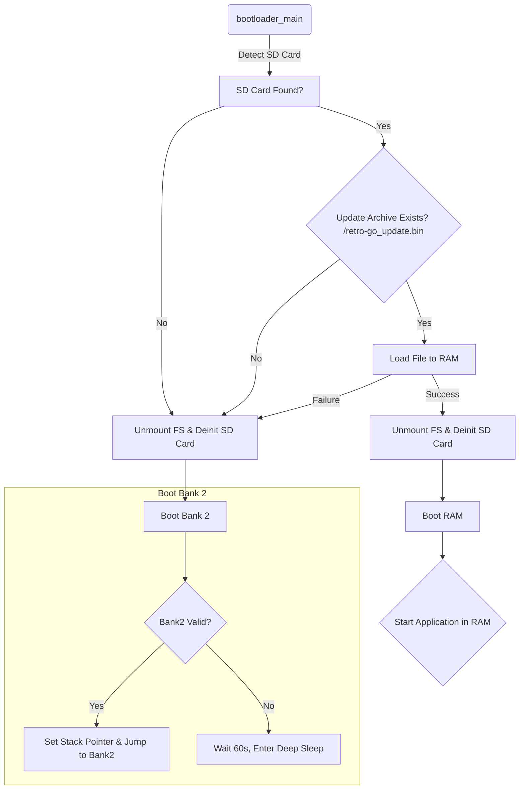

# game-and-watch-bootloader
Game & Watch Bootloader is an application designed to allow easy installation/update of application on Game & Watch devices.

This allows updating Retro-Go simply by loading and running an update package from the SD card.

It is a major part of the Game & Watch [Retro-Go SD](https://github.com/sylverb/game-and-watch-retro-go-sd) project as it allows users to easily install or update [Retro-Go SD](https://github.com/sylverb/game-and-watch-retro-go-sd)

# Installation

## Requirements
To install the bootloader on your Game & Watch, you need a JTAG adapter (such as an ST-Link v2).

You'll need the [gnwmanager](https://github.com/BrianPugh/gnwmanager) application to flash the bootloader onto your console.

## Flashing the bootloader
### By compiling the project
```
git clone --recurse-submodules https://github.com/sylverb/game-and-watch-bootloader
make flash
```
### By flashing released version
Download the latest released version [here](https://github.com/sylverb/game-and-watch-bootloader/releases/)
Flash the binary in the internal flash of the Game & Watch using [gnwmanager](https://github.com/BrianPugh/gnwmanager).
```
gnwmanager flash bank1 gnw_bootloader.bin -- start bank1
```

# Limitations
Currently, this bootloader is not compatible with dual boot (i.e., having both the original firmware and Retro-Go).

# Possible improvements
A self-diagnostic menu could be displayed if there is no valid content in Bank 2 or if a specific key is pressed at startup. It could show the bootloader version, SD Card status, external flash status (detected or not, size of flash/model), ...

# Technical info
## How it works
The flowchart for the application is the following :


## Update archive format
/retro-go_update.bin must be an executable application built to run from RAM (@0x24000000).
Two cases are handled:
- If the file is 1MB or smaller, it is loaded into RAM, and the bootloader starts the loaded application.
- If the file is larger than 1MB, its contents follow this structure:

| Application Binary (1024 KB)  | Binary Length (4 Bytes) | Payload (Remaining) |
| ----------------------------- | ----------------------- | ------------------- |


The advantage of this format is that it combines the firmware update application and the firmware binary into a single file, simplifying the update process for users.